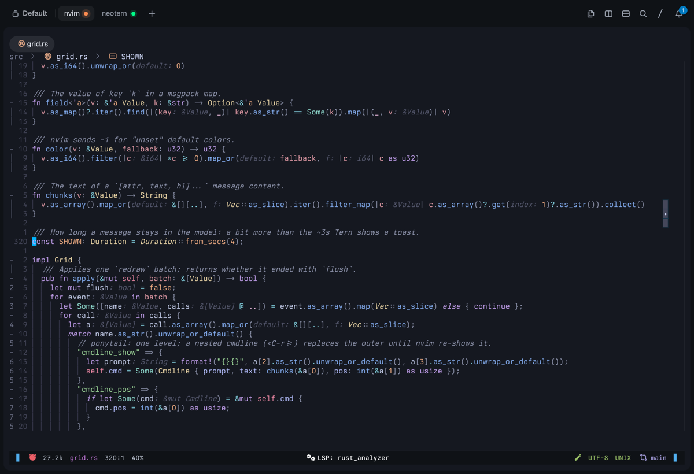
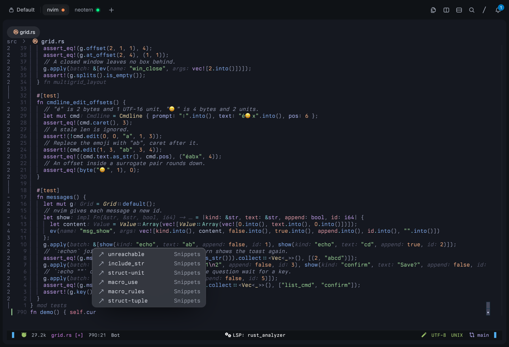
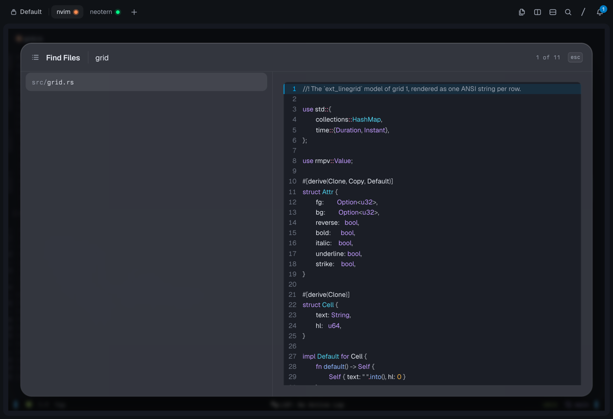
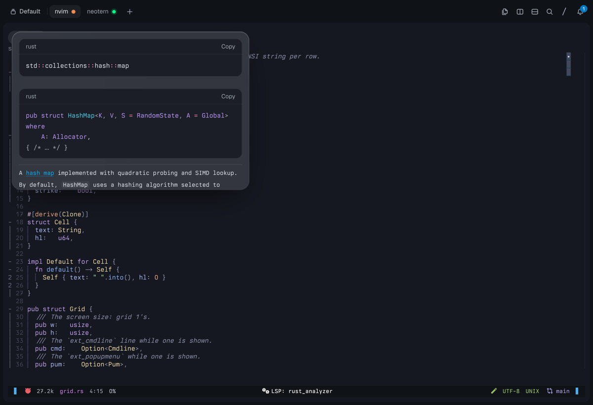
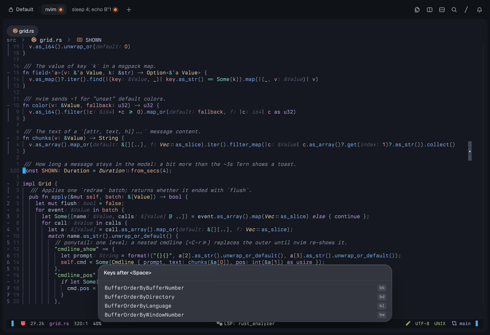

# neotern

Neovim drawn as a native [Tern](https://docs.stencil.so/tern) surface, in the style of Neovide.

neotern runs `nvim --embed`, reads its UI events, and draws them with Tern's own elements: real text
with a real caret, a native command palette, a native picker, native cards. The terminal grid is
gone.



> [!WARNING]
> **Alpha software.** It works for daily use on one machine, and it breaks in ways nobody has met
> yet. Expect sharp edges, missing cases and changing internals.

It is also **highly specialized for my dotfiles**: it bridges the exact plugins I run
(blink.cmp, Telescope, lualine, barbecue, which-key) by wrapping their internals, and it assumes my
options. Suggestions, issues and patches that generalize it are very welcome.

## Features

- **Every window is a Tern editor** ([`ext_multigrid`](https://neovim.io/doc/user/ui.html#ui-multigrid)).
  Each nvim window becomes an `editor` node at its own cell position, so the text is text: Tern
  draws the caret, keeps a selection, and a click lands on a character. nvim keeps the wrapping,
  the scrolling and the layout.
- **The mouse works.** A click comes back as a caret offset, which neotern turns into
  `nvim_input_mouse` on that window's grid. nvim resolves the buffer position itself, with folds,
  signs and wrapping. A click in another window changes the current window.
- **The cursor looks like nvim's** ([`mode_info_set`](https://neovim.io/doc/user/ui.html#ui-event-mode_info_set)):
  a block over the character, an underline in replace mode, and Tern's bar caret in insert mode.
- **The command line is Tern's command palette** ([`ext_cmdline`](https://neovim.io/doc/user/ui.html#ui-cmdline)):
  a focused field in a glass card at the top, with the cmdline completions under it.
- **Completion is a native list** ([`ext_popupmenu`](https://neovim.io/doc/user/ui.html#ui-popupmenu)),
  with an icon per kind and the documentation of the selected item beside it. A bridge sends
  [blink.cmp](https://github.com/Saghen/blink.cmp)'s own menu and docs through the same path.

  
- **Telescope is a native picker sheet** ([telescope.nvim](https://github.com/nvim-telescope/telescope.nvim)):
  a search head, the entries with a dim directory, and a preview of highlighted code with line
  numbers and a mark on the matched line. A click selects, a double click opens.

  
- **Hover and signature help are markdown cards**, with highlighted code blocks, from
  `vim.lsp.util.open_floating_preview`.

  
- **which-key is a card of keycaps** ([which-key.nvim](https://github.com/folke/which-key.nvim)):
  one row per key that can follow, with its description.

  
- **Messages are toasts and cards** ([`ext_messages`](https://neovim.io/doc/user/ui.html#ui-messages)):
  one line is a toast, a longer output is a card that waits for a key, and a `confirm()` question
  sits above its prompt.
- **The tab strip is Tern's** ([`ext_tabline`](https://neovim.io/doc/user/ui.html#ui-tabline)): the
  tab pages, or the listed buffers while there is one tab page, each with its
  [nvim-web-devicons](https://github.com/nvim-tree/nvim-web-devicons) icon. A click goes there.
- **The status line is Tern's status strip** and the breadcrumbs sit over the grid:
  [lualine](https://github.com/nvim-lualine/lualine.nvim) and
  [barbecue](https://github.com/utilyre/barbecue.nvim) render on demand, and their highlights
  become Tern spans in nvim's own colors.
- **Floats are cards.** Any other floating window keeps working, drawn as a card over the text.

## Requirements

- [Tern](https://docs.stencil.so/tern) 0.5.2 or newer (the editor gutter, `nowrap` and `topline`
  landed there).
- [Neovim](https://github.com/neovim/neovim) 0.12 or newer.
- A Rust toolchain for the build.

## Use

```sh
cargo build --release
cp target/release/neotern ~/.local/bin/   # anywhere on your PATH
neotern path/to/file
```

Outside Tern, neotern runs plain `nvim` with your arguments, so it is safe to alias `vim` to it.

`g:neotern` is 1 before your config runs, like `g:neovide`. Use it to skip plugins that take over
the same parts of the UI:

```lua
-- noice.nvim refuses to run next to an ext_cmdline UI
M.cond = not vim.g.neotern
```

My own config needs these three guards:
[noice.nvim](https://github.com/folke/noice.nvim) off,
[nvim-treesitter-context](https://github.com/nvim-treesitter/nvim-treesitter-context) off (the
breadcrumbs already name the scope), and `cmdheight = 0`.

### Who scrolls

By default nvim owns the viewport: each window grid is exactly the box on screen, so every scroll
is nvim's and the wheel does nothing.

```lua
vim.g.neotern_overscan = 3   -- give each window grid 3 screens of text
```

With more than one screen, nvim renders the extra lines into the grid and **Tern** scrolls them:
the wheel works, and Tern scrolls back to the cursor whenever it moves. neotern keeps that band
useful: it sets `'scrolloff'` so nvim centres the cursor in the grid, which leaves wheel room above
and below it, it never asks for more rows than the file has, so the last line really is the end, and
it sets `'scroll'` to half the visible height, so `<C-d>` and `<C-u>` still page what you see.

The wheel reaches the ends of that band and stops there, because TSP never tells a program that the
user scrolled. Keys move the view further, and the band follows the cursor. For the same reason
`H`, `M`, `L`, `zz`, `zt`, `zb` and `'scrolloff'` speak about the grid, not about what you see.

## How it works

Four source files and five Lua bridges, about 1500 lines:

| File | What it does |
| --- | --- |
| `src/nvim.rs` | Spawns `nvim --embed` and streams its `redraw` notifications. |
| `src/grid.rs` | The UI model: a cell grid per nvim grid, the windows, the cmdline, the menu, the messages. |
| `src/main.rs` | The Tern session: the view, the stylesheets, the keys, the mouse. |
| `src/blink.lua` | blink.cmp's menu and docs as `popupmenu_*` events. |
| `src/telescope.lua` | Telescope's prompt, entries and preview as a picker. |
| `src/status.lua` | lualine, barbecue and the devicons, every 100 ms. |
| `src/float.lua` | Hover and signature help as markdown. |
| `src/keys.lua` | which-key's follow-up keys. |

[`docs/design.md`](docs/design.md) has the full design and the known limits, including what a cell
loses on its way into a Tern node.

Built on the [Tern Surface Protocol](https://docs.stencil.so/tern/protocol/) through
[tern-sdk](https://github.com/stencil-hq/tern-sdk).
